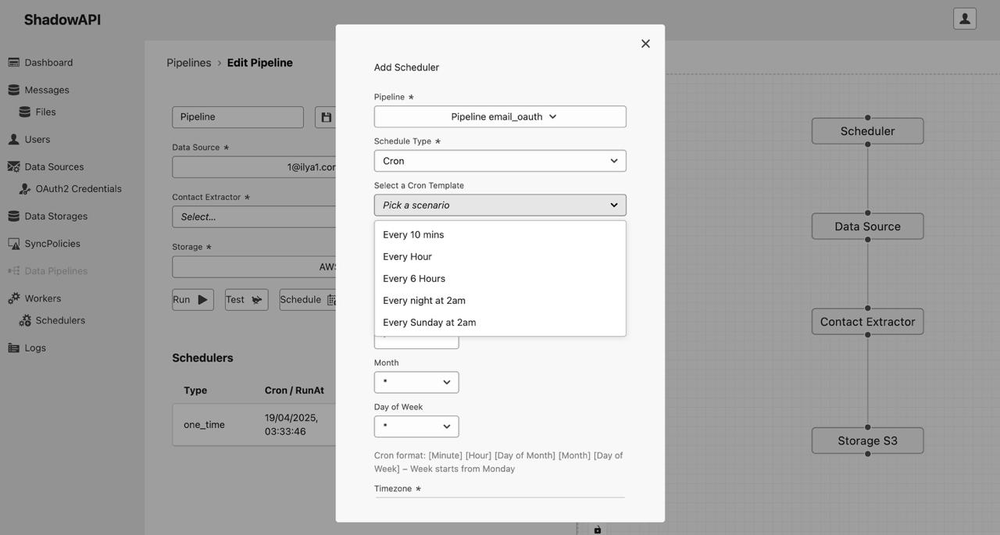

# ShadowAPI

ShadowAPI is a **unified messaging API** that enables seamless integration with Gmail, Telegram, WhatsApp, and LinkedIn in your applications.

It provides a single interface for managing both personal and team‑shared messages across platforms, letting you tag, process, and expose communications via REST endpoints, large language models (LLMs), or message‑centric processing (MCP) workflows.




# Contact 

ShadowAPI is a spin-off project of Reactima CRM (https://reactima.com/).

Your feature requests will be prioritized if you can sponsor 20 hours of development per week. Project ownership, licences, and other details can be discussed.

Please contact [@reactima](https://github.com/reactima) for details.

## Development Setup

We use [Task](https://taskfile.dev/installation/) instead of traditional Makefiles to manage the project. Make sure Task and Docker Compose are both installed.

### 1. Initialize

```bash
task init
```

- Builds necessary images (including an image for SQLC).
- Installs frontend dependencies.

### 2. Start Development Environment

```bash
task dev-up
```

- Spins up all services in development mode (frontend, backend with hot reload, database, etc.).

### 3. Apply Database Migrations

```bash
task sync-db
```

- Applies migrations against the development database.

### 4. Access the App

- Open your browser at [http://localtest.me](http://localtest.me).
- You can sign up via [http://localtest.me/signup](http://localtest.me/signup).

### 5. Stopping the Development Environment

```bash
task dev-down
```

---

## Additional Commands

### Resetting the Development Environment

```bash
task clean
```

- Brings down the dev environment, removes volumes, images, and orphan containers.
- **Warning:** This permanently deletes all data in the development PostgreSQL database.

### Production Build and Run

```bash
task prod-up
```

- Builds optimized production images and spins up containers using `docker-compose.prod.yaml`.

```bash
task prod-down
```

- Stops and removes the production environment containers.

---

## Common Tasks

- **Open Shell in Backend Container:** `task shell`
- **Open Postgres Shell:** `task db-shell`
- **Regenerate SQL Queries (SQLC):** `task sqlc`
- **Generate API Specs (Backend + Frontend):** `task api-gen`
- **Run Playwright Tests (Frontend):** `task playwright-run`

## ZITADEL Authentication

To enable login via [ZITADEL](https://zitadel.com) create a service user and grant it the
`urn:zitadel:iam:org:project:id:zitadel:aud` scope. Set the following values in
`backend/config.yaml`:

```yaml
auth:
  zitadel:
    instance_url: "https://<your-zitadel-domain>"
    client_id: "<service-user-client-id>"
    client_secret: "<service-user-client-secret>"
    redirect_uri: "http://localtest.me/auth/callback"
    intercepted_paths: ["/.well-known/", "/oauth/", "/oidc/"]
```

The intercepted paths section is used by the reverse proxy middleware when a
frontend proxy is required.

### Example ZITADEL Project Setup
Zitadel instance runs on **reactima.com**. When creating a project and web app
in Zitadel, add the following redirect URIs:

```
https://reactima.com/auth/callback
https://reactima.com/logout/callback
```

Redirect URIs must begin with `https://` unless development mode is enabled.
Make sure to also configure the post logout redirect URI.


# Roadmap v0.1~1.0, Q1-Q4, 2025 scheduled features

All messengers (Gmail, Telegram, WhatsApp, LinkedIn) should support the following functionalities:

#### **UserManagement**
- Each user can have multiple `accounts`, where each account represents a unique presence on a platform (e.g., Gmail, Telegram, WhatsApp, LinkedIn). The relationship is **1:N** (one user to many accounts). In a database, this can be modeled with a `Users` table storing user profiles and an `Accounts` table linking each account to a user via a `userId` foreign key.

#### **AccountManagement**
- Accounts can be of type `personal`, `business`, or `bot`.
- Availability statuses include `online`, `offline`, `blocked`, and `muted`.
- Sessions store `sessionHistory`, `participants`, and `meta`.

**Advanced Features:**
- **MultiDeviceSession:** Maintain multiple active sessions across different devices (e.g., logged in on web & mobile).
- **SessionLifetimePolicy:** Define session expiration and auto-renew policies.
- **PersistentAuthTokens:** Implement refresh tokens or authentication persistence across platforms.

#### **ContactManagement**
- Users can manage a `ContactDirectory`, including known and unknown peers
- Contacts can belong to different `communicationChannels` (e.g., email, chat, social media)
- Contacts support attributes like `displayName`, `username`, `language`, `availabilityStatus`, `profilePicture`, and `meta` (e.g., `externalCrmId`)
- Contacts can be enriched by external CRM data and have similar structure to Reactima CRM

**Scheduled for v2.x:**
- **ContactLinking**
Handles linking external users to internal contacts and creating new contacts.
  - Links an external user to an existing internal contact.
  - Creates a new contact from an ongoing conversation.
- **SyncContactsAcrossPlatforms:** Ensures contacts from Gmail, Telegram, WhatsApp, and LinkedIn sync correctly.
- **MergeDuplicateEntries:** Handles cases where the same user exists on multiple platforms.

#### **Message vs Chat vs Thread **

#### **Chat** (Conversation Context)
A **chat** represents a conversation channel, which can be either:
- **Private (1-on-1):** A direct conversation between two users.
- **Public (Group or Channel):** Multiple participants in a shared discussion.

**Chat Structure:**
- **Participants:** `user`, `agent` (e.g., tech support, billing), or `bot`.
- **Gateway Info:** Tracks how the chat was established (e.g., WebChat, Telegram, WhatsApp).
- **Title:** Name of the chat (for groups or channels).
- **Join/Leave Tracking:**
    - `join`, `left`: Logs user entries and exits.
    - `status`: Member states (`member`, `left`, `kicked`, etc.).

    
#### **Thread** (Focused Sub-Conversation)
A **thread** represents a **nested** discussion within a chat.
- Can be a **comment thread** on a message.
- Often used in **group chats** to structure discussions.
- Useful for **support tickets** or **session-based conversations**.

**Thread Features:**
- **Reply Threads & Nested Replies:** Supports direct responses to specific messages (like Telegram’s thread feature).
- **Session Lifecycle Management:** Tracks thread **start, close, participants**.
- **Meta:** Contains session-based tracking, such as:
    - Support ticket history.
    - Chat session history per participant.


#### **Message** (Individual Communication Unit)
A **message** is the fundamental unit of communication within a chat or thread.

**Types of Messages:**
- `text` (basic text messages)
- `attachments` (file/document uploads)
- `reactions` (e.g., 👍, 😂, like, dislike)
- `seen/read receipts`
- 
**Message Forwarding:**
- **Original sender:** `forwardFrom`
- **Source chat:** `forwardFromChatID`
- **Original message ID:** `forwardFromMessageID`
- **Forwarding metadata:** `forwardMeta` (additional context)

**Scheduled for v2.x:**
- **Voice Messages & Speech-to-Text:** Supports voice-based communication.
- **Mentions & Tagging** (`@username` or `@group`): Notifies specific users.
- **Embedded Actions:**
  - Action buttons (`keyboard`, `postback`) for interactive messages.
- `expires_in` (self-destruct messages, e.g., 24h)
- `message edits`
- `invites` (new member invitations)
- `notifications` (e.g., user joins or leaves)
- `typing indicators`
- `uploads in progress`

#### **Attachments & File Storage**
- Messages support `file attachments`, including documents, images, and media files.
- Attachments have metadata like:
  - `size`
  - `type (MIME)`
  - `name`
  - `storage URL`
- Files can be stored in:
  - `S3`
  - `Local host files`
  - `PostgreSQL` (storing full message history and attachments)
- **File preview & in-line rendering:** Display image, PDF, or video previews inside the chat.

**Scheduled for v2.x:**
- **End-to-end encryption for file storage:** Securing attachments in private chats.
- **File versioning:** If a user re-uploads an updated version of a file.

#### **Search & Query Language**
- Search supports a **Gmail-like syntax** with filters for:
  - `Threads`
  - `From the first email`
  - `Reverse order (latest to earliest)`
  - `Messages where the user is in TO, CC, or FROM fields`
- Queries should allow filtering by:
  - `text content`
  - `date range`
  - `message type`
  - `participants`
  - `attachment presence`
- Sorting options include `ascending` or `descending` by date.
- Search pagination supports:
  - `page size`
  - `page number`

**Scheduled for v2.x:**
- **Fuzzy search & typo tolerance:** Helps find messages even if users make mistakes.
- **Sentiment analysis in search:** Rank messages based on tone (positive, negative, neutral).
- **Search within attachments:** OCR (Optical Character Recognition) for searching inside PDFs/images.

#### **Broadcasting Messages v2.x**
- Broadcasting allows sending the same message to multiple recipients at once.
- This is useful for **notifications, announcements, or marketing messages**.
- In the API, this is handled via:
    - **Endpoint:** `/chat/broadcast`
    - **Request Schema:** `BroadcastMessageRequest`
    - **Key Fields:**
        - `peers`: List of recipients
        - `message`: Content of the message
        - `timeout`: Defines how long the broadcast remains active
        - `variables`: Additional metadata for personalization

- **Scheduled broadcasts:** Allow sending messages at a future date/time.
- **Multi-channel broadcasting:** Send a message across Telegram, WhatsApp, and Email simultaneously.
- **A/B Testing for messaging:** Helps optimize marketing campaigns by testing different messages.
- **Broadcast Analytics:** Track delivery, open rates, and user engagement.

**Example Use Case:**
A customer support system sends a service outage notification to all affected users.

#### **Automation Workflows v2.x**
Automation helps manage chat interactions efficiently by handling **routing, bot interactions, and agent transfers**.

##### **(a) Chat Routing v2.x**
- Determines **where a message should go** based on predefined rules.
- Routes messages to:
    - A **specific department** (e.g., billing, technical support)
    - A **priority queue** (e.g., VIP customers)
    - A **specific agent** based on availability

##### **(b) Bot Interactions v2.x**
- Bots can handle **common queries** and reduce agent workload.
- Involves:
    - **Auto-replies** for FAQs
    - **Pre-screening** before connecting to an agent
    - **Lead qualification** in sales chats

##### **(c) Transfers Between Agents v2.x**
- Allows seamless **handoff** of chats between agents.
- Reasons for transfer:
    - A more specialized agent is needed
    - The user was assigned to the wrong department
    - Shift changes or load balancing
- Implemented via **conversation updates** that change the assigned agent.

### **Example Scenario**
1. A user initiates a chat with a bot.
2. The bot detects that the issue is complex.
3. The chat is **routed to the right department**.
4. If the first agent is unable to resolve the issue, the chat is **transferred to a senior agent**.
5. If needed, a **broadcast message** informs all customers about ongoing maintenance.


#### **Infrastructure & Broker**
- **NATS.io** is used as the main **message broker** for event-driven messaging.
- **Data sources** (message storage) can be configured as:
    - `S3`
    - `Host files`
    - `PostgreSQL` (for full message history and attachments)

Please contact [@reactima](https://github.com/reactima) if you would like to speed up the development.