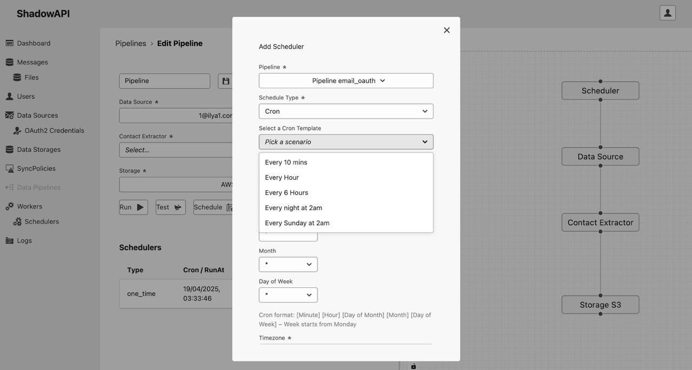

# ShadowAPI

ShadowAPI is a **unified messaging API** that enables seamless integration with Gmail,
Telegram, WhatsApp, and LinkedIn in your applications.

It provides a single interface for managing both personal and team‑shared messages
across platforms, letting you tag, process, and expose communications via REST endpoints,
large language models (LLMs), or message‑centric processing (MCP) workflows.



## Development Setup

We use [Task](https://taskfile.dev/installation/) instead of traditional
Makefiles to manage the project. Make sure Task and Docker Compose are both installed.
We use Zitadel as IDP, and custom login form.
Base domain is `localtest.me`, which resolves to `localhost`.
To access to the zitadel, we use `admin.localtest.me`, which also resolves to `localhost`.
Traefik routes domain based traffic to the correct service.

### 1. Initialize

Copy [.env.example](.env.example) to `.env` and adjust the values as needed.

```bash
cp .env.example .env
# make sure to adjust the values
task init
```

**NOTE**: if you need to override the default Docker Compose file:

```bash
cp compose.override.example.yaml compose.override.yaml
```

### 2. Start Development Environment

```bash
docker compose watch
```

- Spins up all services in development mode (frontend, backend with hot reload,
  database, etc.).

### 3. Apply Database Migrations

```bash
task sync-db
```

- Applies migrations against the development database.

### 4. Access the App

- Open your browser at [http://localtest.me](http://localtest.me).

### 5. Stopping the Development Environment

```bash
docker compose down
```

### Cleaning up Volumes
```bash
docker compose down -v
```
```
